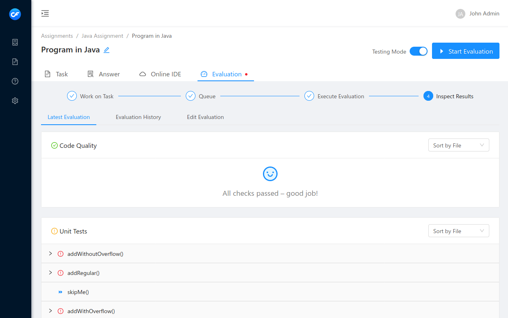

<p align="center">
    
</p>
<h1 align="center">Code FREAK</h1>

[](https://travis-ci.com/codefreak/codefreak)
[](https://sonarcloud.io/dashboard?id=code-freak_code-freak)
[](https://hub.docker.com/cfreak/codefreak)
[](https://www.gnu.org/licenses/agpl-3.0)

Code FREAK is an online programming platform and evaluation/autograding system for coding assignments. It supports every major programming language (language agnostic) and has a modular evaluation system based on Docker.



## Main Features
* [x] Support for every major programming language (language agnostic)
* [x] Pluggable evaluation system based on Docker (Dynamic Testing, Linting, …)
* [x] In-browser IDE based on VSCode/[Coder](https://github.com/cdr/code-server)
* [x] Snappy UI based on React and Ant Design
* [x] Integrates with Learn Management Systems (LMS) via LTI 1.3 standard
* [x] LDAP authentication
* [x] 100% Free and Open Source

## Installation
We only support installation via Docker. The image name is [`cfreak/codefreak`](https://hub.docker.com/cfreak/codefreak). Click the following link to find out the latest version.

[](https://hub.docker.com/cfreak/codefreak)

### Try with Docker 🐋
You can try out Code FREAK locally. The only requirement is a working installation of Docker on your computer.

```shell script
docker run -it --rm \
    -v /var/run/docker.sock:/var/run/docker.sock \
    -p 8080:8080 \
    cfreak/codefreak
```

The UI is accessible at http://localhost:8080.
Log in using `admin` and password `123`.

This will use you local Docker daemon for evaluation and IDE instances.

### Image variants
There are two major image versions on Docker Hub: `latest` and `canary`. `latest` always points to the latest stable release and `canary` is basically a snapshot release based on the `master` branch from GitHub.

Our image tags follow semantic versioning. For example the tag `cfreak/codefreak:4` will always reference the latest v4 release.

### Deployment & Configuration
Our Docker image should run without any further configuration. Out of the box it will use an in-memory database and the Docker daemon available via `/var/run/docker.sock` or the `DOCKER_HOST` environment variable. This is of course NOT suitable for production deployments. Pleas see our installation/deployment guide for detailed instructions and recommendations.

## Documentation
The latest documentation is always available from [docs.codefreak.org](https://docs.codefreak.org). You will find the "raw" documentation files inside the [`/docs`](https://github.com/codefreak/codefreak/tree/master/docs) directory.

## State of the project
The development of Code FREAK started in 2018. Meanwhile, the application has been tested extensively in various computer science courses at the Kiel University of Applied Sciences (Germany). Even if not all bugs have been fixed, yet, the feedback was very positive. All major features (editing, evaluation, reviewing) are working and only need minor optimization. We still have many ideas for new features, and existing features need some refactoring. Development is still ongoing and there will be a lot of additional features, soon.

## Roadmap / Planned features
* [ ] Kubernetes Integration
* [ ] Evaluation system with Windows and MacOS support
* [ ] Git integration for code synchronization
* [ ] Real Autograding and LTI 1.3 Scoring support
* [ ] Plugin for Moodle Tests
* [ ] Localization

## License
    Code FREAK | Code Feedback Review & Evaluation Kit
    Copyright (C) 2019 Kiel University of Applied Sciences

    This program is free software: you can redistribute it and/or modify
    it under the terms of the GNU Affero General Public License as published
    by the Free Software Foundation, either version 3 of the License, or
    (at your option) any later version.

    This program is distributed in the hope that it will be useful,
    but WITHOUT ANY WARRANTY; without even the implied warranty of
    MERCHANTABILITY or FITNESS FOR A PARTICULAR PURPOSE.  See the
    GNU Affero General Public License for more details.

    You should have received a copy of the GNU Affero General Public License
    along with this program.  If not, see <https://www.gnu.org/licenses/>.
